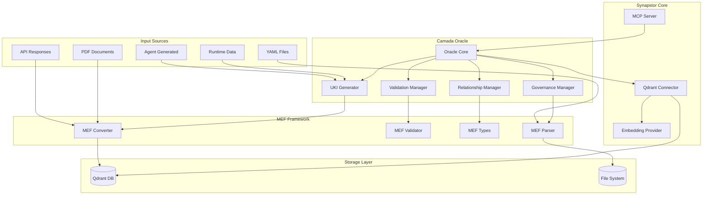
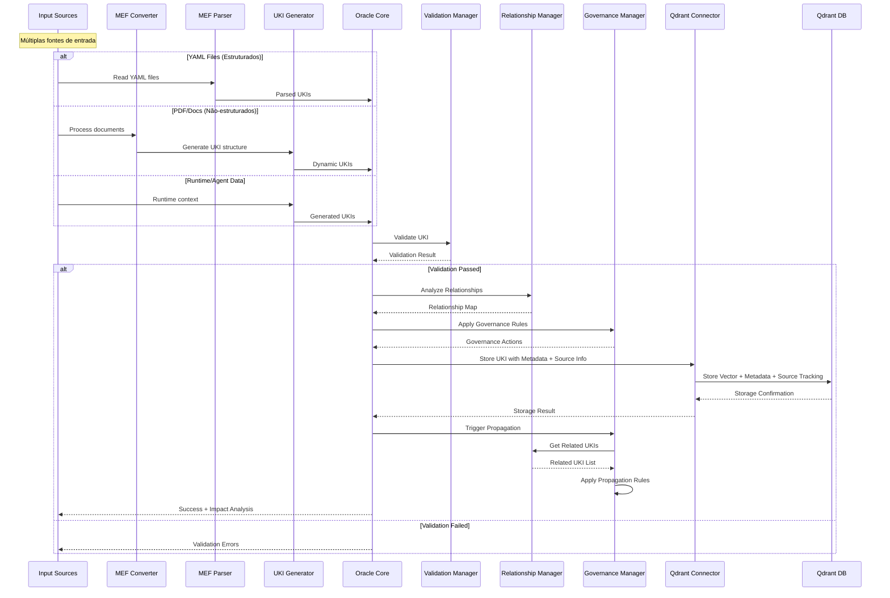
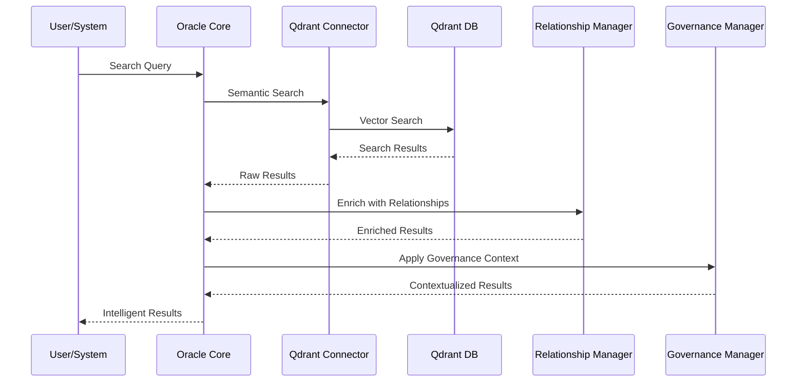
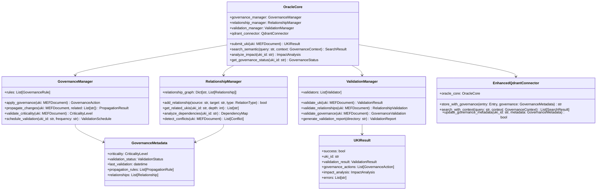

# Proposta de Implementação da Camada Oracle com MEF no Synapstor

## Sumário Executivo

Este documento apresenta uma proposta detalhada para implementar a **Camada Oracle** com **Matrix Embedding Framework (MEF)** no Synapstor, transformando-o de um sistema de armazenamento e recuperação de embeddings em um ecossistema ativo de governança de conhecimento.

## 1. Visão Conceitual

### 1.1 O que é a Camada Oracle

A Camada Oracle é o núcleo de sabedoria do Matrix Protocol, responsável por:
- **Definir diretrizes estratégicas** através de UKIs (Units of Knowledge Interlinked)
- **Governar o conhecimento** com validação automática e propagação de mudanças
- **Manter a consistência** entre diferentes domínios (product, business, technical, strategy, culture)
- **Fornecer inteligência contextual** para tomada de decisões

### 1.2 Integração com MEF

O MEF (Matrix Embedding Framework) padroniza a estruturação do conhecimento em formato YAML, permitindo:
- **Rastreabilidade semântica** através de relacionamentos tipados
- **Versionamento inteligente** com propagação automática de mudanças
- **Validação contínua** da qualidade e consistência do conhecimento
- **Busca semântica avançada** com contexto de governança

## 2. Ganhos e Benefícios

### 2.1 Governança Ativa
- **Validação automática** de UKIs com base em regras de negócio
- **Propagação inteligente** de mudanças para UKIs relacionadas
- **Análise de impacto** antes de modificações críticas
- **Auditoria completa** de mudanças no conhecimento

### 2.2 Rastreabilidade Semântica
- **Relacionamentos tipados** entre UKIs (implements, depends_on, extends, etc.)
- **Mapeamento de dependências** para análise de impacto
- **Histórico de evolução** do conhecimento organizacional
- **Detecção de conflitos** entre diretrizes

### 2.3 Validação Automática
- **Verificação de consistência** entre UKIs relacionadas
- **Validação de formato** e estrutura MEF
- **Análise de qualidade** do conteúdo
- **Alertas proativos** para inconsistências

### 2.4 Inteligência Contextual
- **Busca semântica** com contexto de governança
- **Recomendações inteligentes** baseadas em relacionamentos
- **Análise de tendências** no conhecimento organizacional
- **Insights automáticos** sobre gaps de conhecimento

## 3. Arquitetura Técnica

### 3.1 Abordagem Híbrida: UKIs Físicas vs Dinâmicas

A arquitetura Oracle suporta dois tipos de UKIs:

#### 🗂️ **UKIs Físicas** (File System)
- **Fonte**: Arquivos YAML estruturados no repositório
- **Características**: Versionadas, auditáveis, editáveis manualmente
- **Uso**: Regras de negócio estáveis, padrões arquiteturais, políticas
- **Exemplo**: `auth-pattern.yaml`, `pricing-rules.yaml`

#### ⚡ **UKIs Dinâmicas** (Geradas em Runtime)
- **Fonte**: Documentos PDF, APIs, dados de runtime, agentes
- **Características**: Geradas automaticamente, podem ser temporárias ou persistentes
- **Uso**: Conhecimento extraído, contexto de execução, insights de agentes
- **Exemplo**: Regras extraídas de PDF, decisões de agentes, dados de APIs
- **Armazenamento**: Diretamente no Qdrant DB com metadados de origem

#### 🔄 **Fluxo de Conversão**
```
PDF → MEF Converter → UKI Generator → Qdrant DB
API → MEF Converter → UKI Generator → Qdrant DB
Agent → UKI Generator → Qdrant DB
YAML → MEF Parser → Qdrant DB
```

#### 🎯 **Benefícios da Abordagem Híbrida**
- **Flexibilidade**: Suporte a múltiplas fontes de conhecimento
- **Escalabilidade**: UKIs podem ser geradas em tempo real
- **Governança**: Mesmas regras aplicadas independente da origem
- **Rastreabilidade**: Metadados preservam origem e linhagem
- **Simplicidade**: Único ponto de armazenamento (Qdrant DB) para todos os tipos de UKI

#### 💾 **Estratégia de Armazenamento Unificada**

**Por que apenas Qdrant DB?**
- **Consistência**: Todas as UKIs seguem o mesmo padrão de armazenamento
- **Performance**: Busca semântica otimizada em um único índice
- **Governança**: Aplicação uniforme de regras independente da origem
- **Simplicidade**: Elimina complexidade de múltiplos storages

**Como distinguir UKIs por origem?**
```python
# Metadados de origem armazenados no Qdrant
payload = {
    "uki_id": "business-rule-001",
    "source_type": "pdf_document",  # yaml_file, api_response, agent_generated
    "source_path": "/docs/business-rules.pdf",
    "extraction_method": "pdf_parser",
    "confidence_score": 0.95,
    "is_temporary": False,
    "expires_at": None,  # Para UKIs temporárias
    "file_hash": "sha256:abc123...",  # Para detecção de mudanças
    # ... outros metadados MEF
}
```

**Benefícios desta abordagem:**
- ✅ **File System**: Mantém arquivos YAML originais para versionamento
- ✅ **Qdrant DB**: Armazena TODOS os embeddings + metadados completos
- ✅ **Rastreabilidade**: Metadados preservam origem e método de extração
- ✅ **Flexibilidade**: Suporte a UKIs temporárias e permanentes
- ✅ **Performance**: Busca semântica unificada

### 3.2 Visão Geral da Arquitetura



### 3.2 Fluxo de Dados Híbrido - Ingestão de UKI



### 3.3 Fluxo de Dados - Busca Semântica com Governança



### 3.4 Diagrama de Classes



## 4. Detalhamento Técnico das Mudanças

### 4.1 Extensão do Módulo MEF

#### 4.1.1 Novos Tipos de Dados

**Arquivo: `src/synapstor/mef/governance_types.py`**
```python
from enum import Enum
from typing import List, Dict, Optional, Any
from datetime import datetime
from pydantic import BaseModel, Field

class CriticalityLevel(str, Enum):
    LOW = "low"
    MEDIUM = "medium"
    HIGH = "high"
    CRITICAL = "critical"

class RelationType(str, Enum):
    IMPLEMENTS = "implements"
    DEPENDS_ON = "depends_on"
    EXTENDS = "extends"
    REPLACES = "replaces"
    COMPLIES_WITH = "complies_with"
    CONFLICTS_WITH = "conflicts_with"
    DERIVES_FROM = "derives_from"
    RELATES_TO = "relates_to"

class ValidationStatus(str, Enum):
    PENDING = "pending"
    VALID = "valid"
    INVALID = "invalid"
    NEEDS_REVIEW = "needs_review"

class Relationship(BaseModel):
    target_id: str
    type: RelationType
    description: Optional[str] = None
    strength: float = Field(default=1.0, ge=0.0, le=1.0)
    created_at: datetime = Field(default_factory=datetime.now)

class GovernanceRule(BaseModel):
    id: str
    name: str
    description: str
    condition: Dict[str, Any]
    action: Dict[str, Any]
    priority: int = 0
    active: bool = True

class PropagationRule(BaseModel):
    relationship_types: List[RelationType]
    fields_to_propagate: List[str]
    conditions: Dict[str, Any]
    auto_apply: bool = False

class GovernanceMetadata(BaseModel):
    criticality: CriticalityLevel
    validation_status: ValidationStatus
    last_validation: datetime
    validation_frequency: str  # "daily", "weekly", "monthly"
    auto_propagation: bool = False
    propagation_rules: List[PropagationRule] = []
    impact_score: float = Field(default=0.0, ge=0.0, le=1.0)
    relationships: List[Relationship] = []
```

#### 4.1.2 Parser Estendido

**Arquivo: `src/synapstor/mef/enhanced_parser.py`**
```python
from typing import Dict, List, Optional, Tuple
from .parser import MEFParser
from .governance_types import GovernanceMetadata, Relationship, RelationType
from .types import MEFDocument

class EnhancedMEFParser(MEFParser):
    """Parser MEF estendido com capacidades de governança."""
    
    def parse_with_governance(self, content: str) -> Tuple[MEFDocument, GovernanceMetadata]:
        """Parse documento MEF extraindo metadados de governança."""
        doc = self.parse(content)
        governance = self._extract_governance_metadata(doc)
        return doc, governance
    
    def _extract_governance_metadata(self, doc: MEFDocument) -> GovernanceMetadata:
        """Extrai metadados de governança do documento MEF."""
        governance_data = doc.governance or {}
        
        relationships = []
        for rel_data in doc.related_to or []:
            if isinstance(rel_data, dict):
                relationships.append(Relationship(
                    target_id=rel_data.get('id', ''),
                    type=RelationType(rel_data.get('type', 'relates_to')),
                    description=rel_data.get('description'),
                    strength=rel_data.get('strength', 1.0)
                ))
        
        return GovernanceMetadata(
            criticality=governance_data.get('criticality', 'medium'),
            validation_status='pending',
            last_validation=doc.last_validation or datetime.now(),
            validation_frequency=governance_data.get('validation_frequency', 'monthly'),
            auto_propagation=governance_data.get('auto_propagation', False),
            relationships=relationships
        )
    
    def extract_relationship_graph(self, documents: List[MEFDocument]) -> Dict[str, List[Relationship]]:
        """Extrai grafo de relacionamentos de uma lista de documentos."""
        graph = {}
        
        for doc in documents:
            relationships = []
            for rel_data in doc.related_to or []:
                if isinstance(rel_data, dict):
                    relationships.append(Relationship(
                        target_id=rel_data.get('id', ''),
                        type=RelationType(rel_data.get('type', 'relates_to')),
                        description=rel_data.get('description'),
                        strength=rel_data.get('strength', 1.0)
                    ))
            
            graph[doc.id] = relationships
        
        return graph
```

### 4.2 Criação do Módulo Oracle

#### 4.2.1 Oracle Core

**Arquivo: `src/synapstor/oracle/__init__.py`**
```python
from .core import OracleCore
from .governance import GovernanceManager
from .relationships import RelationshipManager
from .validation import ValidationManager
from .types import UKIResult, SearchResult, ImpactAnalysis

__all__ = [
    'OracleCore',
    'GovernanceManager', 
    'RelationshipManager',
    'ValidationManager',
    'UKIResult',
    'SearchResult',
    'ImpactAnalysis'
]
```

**Arquivo: `src/synapstor/oracle/core.py`**
```python
import asyncio
from typing import List, Optional, Dict, Any
from datetime import datetime

from ..mef.types import MEFDocument
from ..mef.enhanced_parser import EnhancedMEFParser
from ..mef.governance_types import GovernanceMetadata, GovernanceRule
from ..qdrant import QdrantConnector, Entry
from .governance import GovernanceManager
from .relationships import RelationshipManager
from .validation import ValidationManager
from .types import UKIResult, SearchResult, ImpactAnalysis, GovernanceContext

class OracleCore:
    """Núcleo da Camada Oracle - gerencia governança de conhecimento."""
    
    def __init__(
        self,
        qdrant_connector: QdrantConnector,
        governance_rules: Optional[List[GovernanceRule]] = None
    ):
        self.qdrant_connector = qdrant_connector
        self.parser = EnhancedMEFParser()
        
        # Inicializa managers
        self.governance_manager = GovernanceManager(governance_rules or [])
        self.relationship_manager = RelationshipManager()
        self.validation_manager = ValidationManager()
        
        # Cache para otimização
        self._relationship_cache: Dict[str, List[str]] = {}
        self._governance_cache: Dict[str, GovernanceMetadata] = {}
    
    async def submit_uki(self, uki_content: str, source_path: Optional[str] = None) -> UKIResult:
        """Submete uma UKI para processamento com governança completa."""
        try:
            # Parse do documento MEF
            doc, governance = self.parser.parse_with_governance(uki_content)
            
            # Validação
            validation_result = await self.validation_manager.validate_uki(doc)
            if not validation_result.is_valid:
                return UKIResult(
                    success=False,
                    uki_id=doc.id,
                    validation_result=validation_result,
                    errors=validation_result.errors
                )
            
            # Análise de relacionamentos
            await self.relationship_manager.analyze_relationships(doc)
            
            # Aplicação de governança
            governance_actions = await self.governance_manager.apply_governance(doc, governance)
            
            # Armazenamento
            entry = Entry(
                content=doc.content,
                metadata={
                    'id': doc.id,
                    'title': doc.title,
                    'domain': doc.domain,
                    'type': doc.type,
                    'context': doc.context,
                    'language': doc.language,
                    'governance': governance.dict(),
                    'source_path': source_path
                }
            )
            
            uki_id = await self.qdrant_connector.store(entry)
            
            # Análise de impacto
            impact_analysis = await self.analyze_impact(doc.id)
            
            # Propagação de mudanças
            if governance.auto_propagation:
                await self.governance_manager.propagate_changes(doc, governance)
            
            # Atualiza caches
            self._update_caches(doc.id, governance)
            
            return UKIResult(
                success=True,
                uki_id=uki_id,
                validation_result=validation_result,
                governance_actions=governance_actions,
                impact_analysis=impact_analysis
            )
            
        except Exception as e:
            return UKIResult(
                success=False,
                uki_id=getattr(doc, 'id', 'unknown'),
                errors=[str(e)]
            )
    
    async def search_semantic(
        self, 
        query: str, 
        context: Optional[GovernanceContext] = None,
        limit: int = 10
    ) -> List[SearchResult]:
        """Busca semântica com contexto de governança."""
        # Busca básica no Qdrant
        raw_results = await self.qdrant_connector.search(query, limit=limit * 2)
        
        # Enriquecimento com relacionamentos
        enriched_results = []
        for result in raw_results:
            uki_id = result.payload.get('id')
            if uki_id:
                # Busca relacionamentos
                relationships = await self.relationship_manager.get_related_ukis(uki_id)
                
                # Busca metadados de governança
                governance = self._governance_cache.get(uki_id)
                
                enriched_results.append(SearchResult(
                    uki_id=uki_id,
                    content=result.payload.get('content', ''),
                    score=result.score,
                    metadata=result.payload,
                    relationships=relationships,
                    governance=governance
                ))
        
        # Aplicação de contexto de governança
        if context:
            enriched_results = await self._apply_governance_context(enriched_results, context)
        
        return enriched_results[:limit]
    
    async def analyze_impact(self, uki_id: str) -> ImpactAnalysis:
        """Analisa o impacto de mudanças em uma UKI."""
        # Busca UKIs relacionadas
        related_ukis = await self.relationship_manager.get_related_ukis(uki_id, depth=3)
        
        # Calcula métricas de impacto
        direct_dependencies = len([r for r in related_ukis if r.get('depth') == 1])
        total_affected = len(related_ukis)
        
        # Análise de criticidade
        governance = self._governance_cache.get(uki_id)
        criticality_score = self._calculate_criticality_score(governance)
        
        return ImpactAnalysis(
            uki_id=uki_id,
            direct_dependencies=direct_dependencies,
            total_affected=total_affected,
            criticality_score=criticality_score,
            affected_domains=self._get_affected_domains(related_ukis),
            risk_level=self._calculate_risk_level(criticality_score, total_affected)
        )
    
    def _update_caches(self, uki_id: str, governance: GovernanceMetadata):
        """Atualiza caches internos."""
        self._governance_cache[uki_id] = governance
        # Invalida cache de relacionamentos para forçar recálculo
        if uki_id in self._relationship_cache:
            del self._relationship_cache[uki_id]
    
    async def _apply_governance_context(
        self, 
        results: List[SearchResult], 
        context: GovernanceContext
    ) -> List[SearchResult]:
        """Aplica contexto de governança aos resultados de busca."""
        filtered_results = []
        
        for result in results:
            # Filtros de governança
            if context.min_criticality and result.governance:
                if result.governance.criticality.value < context.min_criticality.value:
                    continue
            
            if context.validation_status and result.governance:
                if result.governance.validation_status != context.validation_status:
                    continue
            
            if context.domains:
                if result.metadata.get('domain') not in context.domains:
                    continue
            
            filtered_results.append(result)
        
        # Ordenação por relevância + governança
        return sorted(
            filtered_results,
            key=lambda r: (r.score, self._calculate_governance_score(r.governance)),
            reverse=True
        )
    
    def _calculate_criticality_score(self, governance: Optional[GovernanceMetadata]) -> float:
        """Calcula score de criticidade."""
        if not governance:
            return 0.5
        
        criticality_map = {
            'low': 0.25,
            'medium': 0.5,
            'high': 0.75,
            'critical': 1.0
        }
        
        return criticality_map.get(governance.criticality.value, 0.5)
    
    def _calculate_governance_score(self, governance: Optional[GovernanceMetadata]) -> float:
        """Calcula score de governança para ordenação."""
        if not governance:
            return 0.0
        
        score = 0.0
        
        # Score por criticidade
        score += self._calculate_criticality_score(governance) * 0.4
        
        # Score por status de validação
        validation_scores = {
            'valid': 1.0,
            'needs_review': 0.7,
            'pending': 0.5,
            'invalid': 0.0
        }
        score += validation_scores.get(governance.validation_status.value, 0.0) * 0.3
        
        # Score por impacto
        score += governance.impact_score * 0.3
        
        return score
    
    def _get_affected_domains(self, related_ukis: List[Dict]) -> List[str]:
        """Extrai domínios afetados."""
        domains = set()
        for uki in related_ukis:
            if 'domain' in uki:
                domains.add(uki['domain'])
        return list(domains)
    
    def _calculate_risk_level(self, criticality: float, affected_count: int) -> str:
        """Calcula nível de risco."""
        risk_score = criticality * (1 + affected_count / 10)
        
        if risk_score >= 0.8:
            return 'high'
        elif risk_score >= 0.5:
            return 'medium'
        else:
            return 'low'
```

#### 4.2.2 Governance Manager

**Arquivo: `src/synapstor/oracle/governance.py`**
```python
import asyncio
from typing import List, Dict, Any, Optional
from datetime import datetime, timedelta

from ..mef.types import MEFDocument
from ..mef.governance_types import (
    GovernanceMetadata, GovernanceRule, PropagationRule, 
    CriticalityLevel, ValidationStatus
)
from .types import GovernanceAction, PropagationResult

class GovernanceManager:
    """Gerencia regras de governança e propagação de mudanças."""
    
    def __init__(self, rules: List[GovernanceRule]):
        self.rules = {rule.id: rule for rule in rules}
        self._propagation_queue: List[Dict[str, Any]] = []
    
    async def apply_governance(
        self, 
        doc: MEFDocument, 
        governance: GovernanceMetadata
    ) -> List[GovernanceAction]:
        """Aplica regras de governança a um documento."""
        actions = []
        
        for rule in self.rules.values():
            if not rule.active:
                continue
            
            if await self._evaluate_condition(doc, governance, rule.condition):
                action = await self._execute_action(doc, governance, rule.action)
                if action:
                    actions.append(GovernanceAction(
                        rule_id=rule.id,
                        action_type=action['type'],
                        description=action['description'],
                        applied_at=datetime.now(),
                        metadata=action.get('metadata', {})
                    ))
        
        return actions
    
    async def propagate_changes(
        self, 
        doc: MEFDocument, 
        governance: GovernanceMetadata
    ) -> PropagationResult:
        """Propaga mudanças para UKIs relacionadas."""
        propagated_count = 0
        errors = []
        
        for rule in governance.propagation_rules:
            try:
                # Busca UKIs relacionadas pelos tipos especificados
                related_ukis = await self._get_related_by_types(
                    doc.id, 
                    rule.relationship_types
                )
                
                for related_id in related_ukis:
                    if await self._should_propagate(doc, related_id, rule):
                        await self._propagate_to_uki(doc, related_id, rule)
                        propagated_count += 1
                        
            except Exception as e:
                errors.append(f"Erro propagando para regra {rule}: {str(e)}")
        
        return PropagationResult(
            source_uki_id=doc.id,
            propagated_count=propagated_count,
            errors=errors,
            completed_at=datetime.now()
        )
    
    async def validate_criticality(self, doc: MEFDocument) -> CriticalityLevel:
        """Valida e sugere nível de criticidade."""
        # Análise baseada em conteúdo e relacionamentos
        score = 0.0
        
        # Fatores de criticidade
        if 'security' in doc.content.lower():
            score += 0.3
        if 'compliance' in doc.content.lower():
            score += 0.3
        if doc.type in ['business_rule', 'guideline']:
            score += 0.2
        if doc.domain in ['technical', 'strategy']:
            score += 0.2
        
        # Mapeamento para níveis
        if score >= 0.8:
            return CriticalityLevel.CRITICAL
        elif score >= 0.6:
            return CriticalityLevel.HIGH
        elif score >= 0.4:
            return CriticalityLevel.MEDIUM
        else:
            return CriticalityLevel.LOW
    
    async def schedule_validation(
        self, 
        uki_id: str, 
        frequency: str
    ) -> Dict[str, Any]:
        """Agenda validação periódica."""
        frequency_map = {
            'daily': timedelta(days=1),
            'weekly': timedelta(weeks=1),
            'monthly': timedelta(days=30),
            'quarterly': timedelta(days=90)
        }
        
        interval = frequency_map.get(frequency, timedelta(days=30))
        next_validation = datetime.now() + interval
        
        return {
            'uki_id': uki_id,
            'frequency': frequency,
            'next_validation': next_validation,
            'scheduled_at': datetime.now()
        }
    
    async def _evaluate_condition(
        self, 
        doc: MEFDocument, 
        governance: GovernanceMetadata, 
        condition: Dict[str, Any]
    ) -> bool:
        """Avalia condição de uma regra de governança."""
        for field, expected in condition.items():
            if field == 'domain':
                if doc.domain != expected:
                    return False
            elif field == 'type':
                if doc.type != expected:
                    return False
            elif field == 'criticality':
                if governance.criticality.value != expected:
                    return False
            elif field == 'content_contains':
                if expected.lower() not in doc.content.lower():
                    return False
        
        return True
    
    async def _execute_action(
        self, 
        doc: MEFDocument, 
        governance: GovernanceMetadata, 
        action: Dict[str, Any]
    ) -> Optional[Dict[str, Any]]:
        """Executa ação de uma regra de governança."""
        action_type = action.get('type')
        
        if action_type == 'set_criticality':
            governance.criticality = CriticalityLevel(action['value'])
            return {
                'type': 'criticality_updated',
                'description': f"Criticidade alterada para {action['value']}",
                'metadata': {'new_criticality': action['value']}
            }
        
        elif action_type == 'require_validation':
            governance.validation_status = ValidationStatus.NEEDS_REVIEW
            return {
                'type': 'validation_required',
                'description': "Validação manual requerida",
                'metadata': {'reason': action.get('reason', 'Regra de governança')}
            }
        
        elif action_type == 'auto_propagate':
            governance.auto_propagation = True
            return {
                'type': 'auto_propagation_enabled',
                'description': "Propagação automática habilitada",
                'metadata': {}
            }
        
        return None
    
    async def _get_related_by_types(
        self, 
        uki_id: str, 
        relationship_types: List[str]
    ) -> List[str]:
        """Busca UKIs relacionadas por tipos específicos."""
        # Implementação dependente do RelationshipManager
        # Por enquanto, retorna lista vazia
        return []
    
    async def _should_propagate(
        self, 
        doc: MEFDocument, 
        related_id: str, 
        rule: PropagationRule
    ) -> bool:
        """Verifica se deve propagar para uma UKI específica."""
        # Avalia condições da regra de propagação
        for field, expected in rule.conditions.items():
            # Implementar lógica de condições
            pass
        
        return True
    
    async def _propagate_to_uki(
        self, 
        source_doc: MEFDocument, 
        target_id: str, 
        rule: PropagationRule
    ):
        """Propaga mudanças para uma UKI específica."""
        # Implementar lógica de propagação
        # Por exemplo, atualizar campos específicos
        pass
```

### 4.3 Extensão do QdrantConnector

**Arquivo: `src/synapstor/enhanced_qdrant.py`**
```python
from typing import List, Dict, Any, Optional
from .qdrant import QdrantConnector, Entry
from .oracle.types import GovernanceContext, SearchResult
from .mef.governance_types import GovernanceMetadata

class EnhancedQdrantConnector(QdrantConnector):
    """Conector Qdrant estendido com capacidades de governança."""
    
    def __init__(self, *args, **kwargs):
        super().__init__(*args, **kwargs)
        self.oracle_core = None  # Será injetado posteriormente
    
    async def store_with_governance(
        self, 
        entry: Entry, 
        governance: GovernanceMetadata
    ) -> str:
        """Armazena entrada com metadados de governança."""
        # Adiciona metadados de governança
        enhanced_metadata = entry.metadata.copy()
        enhanced_metadata.update({
            'governance': governance.dict(),
            'indexed_at': datetime.now().isoformat(),
            'governance_version': '1.0'
        })
        
        enhanced_entry = Entry(
            content=entry.content,
            metadata=enhanced_metadata
        )
        
        return await self.store(enhanced_entry)
    
    async def search_with_context(
        self, 
        query: str, 
        context: Optional[GovernanceContext] = None,
        limit: int = 10
    ) -> List[SearchResult]:
        """Busca com contexto de governança."""
        # Busca básica
        raw_results = await self.search(query, limit=limit * 2)
        
        # Conversão para SearchResult
        search_results = []
        for result in raw_results:
            governance_data = result.payload.get('governance', {})
            governance = None
            if governance_data:
                governance = GovernanceMetadata(**governance_data)
            
            search_results.append(SearchResult(
                uki_id=result.payload.get('id', ''),
                content=result.payload.get('content', ''),
                score=result.score,
                metadata=result.payload,
                governance=governance
            ))
        
        # Aplicação de filtros de contexto
        if context:
            search_results = self._apply_context_filters(search_results, context)
        
        return search_results[:limit]
    
    async def update_governance_metadata(
        self, 
        uki_id: str, 
        governance: GovernanceMetadata
    ) -> bool:
        """Atualiza metadados de governança de uma UKI."""
        try:
            # Busca o ponto atual
            search_results = await self.search(f"id:{uki_id}", limit=1)
            if not search_results:
                return False
            
            point = search_results[0]
            
            # Atualiza metadados
            updated_metadata = point.payload.copy()
            updated_metadata['governance'] = governance.dict()
            updated_metadata['governance_updated_at'] = datetime.now().isoformat()
            
            # Atualiza no Qdrant
            await self.client.upsert(
                collection_name=self.collection_name,
                points=[
                    {
                        'id': point.id,
                        'vector': point.vector,
                        'payload': updated_metadata
                    }
                ]
            )
            
            return True
            
        except Exception as e:
            print(f"Erro atualizando metadados de governança: {e}")
            return False
    
    def _apply_context_filters(
        self, 
        results: List[SearchResult], 
        context: GovernanceContext
    ) -> List[SearchResult]:
        """Aplica filtros de contexto de governança."""
        filtered = []
        
        for result in results:
            # Filtro por criticidade mínima
            if context.min_criticality and result.governance:
                if result.governance.criticality.value < context.min_criticality.value:
                    continue
            
            # Filtro por status de validação
            if context.validation_status and result.governance:
                if result.governance.validation_status != context.validation_status:
                    continue
            
            # Filtro por domínios
            if context.domains:
                if result.metadata.get('domain') not in context.domains:
                    continue
            
            # Filtro por tipos
            if context.types:
                if result.metadata.get('type') not in context.types:
                    continue
            
            filtered.append(result)
        
        return filtered
```

### 4.4 Extensão do MCP Server

**Arquivo: `src/synapstor/enhanced_mcp_server.py`**
```python
from typing import List, Dict, Any, Optional
from .mcp_server import SynapseMCPServer
from .oracle.core import OracleCore
from .oracle.types import GovernanceContext
from .mef.governance_types import CriticalityLevel, ValidationStatus

class EnhancedSynapseMCPServer(SynapseMCPServer):
    """Servidor MCP estendido com capacidades Oracle."""
    
    def __init__(self, *args, **kwargs):
        super().__init__(*args, **kwargs)
        self.oracle_core: Optional[OracleCore] = None
    
    def set_oracle_core(self, oracle_core: OracleCore):
        """Injeta o Oracle Core."""
        self.oracle_core = oracle_core
    
    async def submit_uki_with_governance(self, uki_content: str, source_path: Optional[str] = None) -> Dict[str, Any]:
        """Submete UKI com processamento de governança completo."""
        if not self.oracle_core:
            return {'error': 'Oracle Core não configurado'}
        
        result = await self.oracle_core.submit_uki(uki_content, source_path)
        
        return {
            'success': result.success,
            'uki_id': result.uki_id,
            'validation_errors': result.errors,
            'governance_actions': [action.dict() for action in result.governance_actions] if result.governance_actions else [],
            'impact_analysis': result.impact_analysis.dict() if result.impact_analysis else None
        }
    
    async def search_with_governance(
        self, 
        query: str,
        min_criticality: Optional[str] = None,
        validation_status: Optional[str] = None,
        domains: Optional[List[str]] = None,
        types: Optional[List[str]] = None,
        limit: int = 10
    ) -> Dict[str, Any]:
        """Busca semântica com contexto de governança."""
        if not self.oracle_core:
            return {'error': 'Oracle Core não configurado'}
        
        # Constrói contexto de governança
        context = GovernanceContext(
            min_criticality=CriticalityLevel(min_criticality) if min_criticality else None,
            validation_status=ValidationStatus(validation_status) if validation_status else None,
            domains=domains,
            types=types
        )
        
        results = await self.oracle_core.search_semantic(query, context, limit)
        
        return {
            'query': query,
            'context': context.dict() if context else None,
            'results': [
                {
                    'uki_id': r.uki_id,
                    'content': r.content[:500] + '...' if len(r.content) > 500 else r.content,
                    'score': r.score,
                    'metadata': r.metadata,
                    'governance': r.governance.dict() if r.governance else None,
                    'relationships_count': len(r.relationships) if r.relationships else 0
                }
                for r in results
            ],
            'total_results': len(results)
        }
    
    async def analyze_uki_impact(self, uki_id: str) -> Dict[str, Any]:
        """Analisa impacto de mudanças em uma UKI."""
        if not self.oracle_core:
            return {'error': 'Oracle Core não configurado'}
        
        impact = await self.oracle_core.analyze_impact(uki_id)
        
        return {
            'uki_id': uki_id,
            'impact_analysis': impact.dict()
        }
    
    async def get_governance_status(self, uki_id: str) -> Dict[str, Any]:
        """Obtém status de governança de uma UKI."""
        if not self.oracle_core:
            return {'error': 'Oracle Core não configurado'}
        
        # Busca a UKI
        results = await self.oracle_core.search_semantic(f"id:{uki_id}", limit=1)
        if not results:
            return {'error': 'UKI não encontrada'}
        
        result = results[0]
        
        return {
            'uki_id': uki_id,
            'governance': result.governance.dict() if result.governance else None,
            'relationships': [
                {
                    'target_id': rel.get('target_id'),
                    'type': rel.get('type'),
                    'strength': rel.get('strength', 1.0)
                }
                for rel in result.relationships
            ] if result.relationships else [],
            'metadata': result.metadata
        }
    
    async def validate_uki_directory(self, directory_path: str) -> Dict[str, Any]:
        """Valida todas as UKIs em um diretório."""
        if not self.oracle_core:
            return {'error': 'Oracle Core não configurado'}
        
        validation_report = await self.oracle_core.validation_manager.generate_validation_report(directory_path)
        
        return {
            'directory': directory_path,
            'validation_report': validation_report.dict()
        }
```

### 4.5 Configurações e Inicialização

**Arquivo: `src/synapstor/oracle_config.py`**
```python
from typing import List, Dict, Any
from .mef.governance_types import GovernanceRule, PropagationRule, RelationType

# Regras de governança padrão
DEFAULT_GOVERNANCE_RULES = [
    GovernanceRule(
        id="security_high_criticality",
        name="Criticidade Alta para Segurança",
        description="UKIs relacionadas à segurança devem ter criticidade alta",
        condition={
            "content_contains": "security"
        },
        action={
            "type": "set_criticality",
            "value": "high"
        },
        priority=10
    ),
    GovernanceRule(
        id="compliance_validation_required",
        name="Validação Obrigatória para Compliance",
        description="UKIs de compliance requerem validação manual",
        condition={
            "content_contains": "compliance"
        },
        action={
            "type": "require_validation",
            "reason": "Conteúdo relacionado a compliance"
        },
        priority=9
    ),
    GovernanceRule(
        id="business_rule_auto_propagation",
        name="Propagação Automática para Regras de Negócio",
        description="Regras de negócio devem propagar mudanças automaticamente",
        condition={
            "type": "business_rule"
        },
        action={
            "type": "auto_propagate"
        },
        priority=5
    )
]

# Configurações de propagação padrão
DEFAULT_PROPAGATION_RULES = [
    PropagationRule(
        relationship_types=[RelationType.IMPLEMENTS, RelationType.DEPENDS_ON],
        fields_to_propagate=["version", "last_validation"],
        conditions={"auto_propagation": True},
        auto_apply=True
    ),
    PropagationRule(
        relationship_types=[RelationType.EXTENDS],
        fields_to_propagate=["content", "examples"],
        conditions={"criticality": "high"},
        auto_apply=False
    )
]

# Configurações do Oracle
ORACLE_CONFIG = {
    "governance_rules": DEFAULT_GOVERNANCE_RULES,
    "propagation_rules": DEFAULT_PROPAGATION_RULES,
    "validation_frequency": "weekly",
    "auto_propagation_enabled": True,
    "impact_analysis_depth": 3,
    "cache_ttl_seconds": 3600
}
```

**Arquivo: `src/synapstor/oracle_factory.py`**
```python
from typing import Optional, List
from .oracle.core import OracleCore
from .enhanced_qdrant import EnhancedQdrantConnector
from .enhanced_mcp_server import EnhancedSynapseMCPServer
from .mef.governance_types import GovernanceRule
from .oracle_config import ORACLE_CONFIG

class OracleFactory:
    """Factory para criação e configuração do Oracle."""
    
    @staticmethod
    def create_oracle_core(
        qdrant_connector: EnhancedQdrantConnector,
        governance_rules: Optional[List[GovernanceRule]] = None
    ) -> OracleCore:
        """Cria instância do Oracle Core."""
        rules = governance_rules or ORACLE_CONFIG["governance_rules"]
        return OracleCore(qdrant_connector, rules)
    
    @staticmethod
    def create_enhanced_qdrant(
        url: str = "http://localhost:6333",
        collection_name: str = "synapstor_oracle",
        **kwargs
    ) -> EnhancedQdrantConnector:
        """Cria conector Qdrant estendido."""
        return EnhancedQdrantConnector(
            url=url,
            collection_name=collection_name,
            **kwargs
        )
    
    @staticmethod
    def create_enhanced_mcp_server(
        oracle_core: OracleCore,
        **kwargs
    ) -> EnhancedSynapseMCPServer:
        """Cria servidor MCP estendido."""
        server = EnhancedSynapseMCPServer(**kwargs)
        server.set_oracle_core(oracle_core)
        return server
    
    @staticmethod
    def create_complete_oracle_system(
        qdrant_url: str = "http://localhost:6333",
        collection_name: str = "synapstor_oracle",
        governance_rules: Optional[List[GovernanceRule]] = None
    ) -> tuple[OracleCore, EnhancedQdrantConnector, EnhancedSynapseMCPServer]:
        """Cria sistema Oracle completo."""
        # Cria conector Qdrant
        qdrant_connector = OracleFactory.create_enhanced_qdrant(
            url=qdrant_url,
            collection_name=collection_name
        )
        
        # Cria Oracle Core
        oracle_core = OracleFactory.create_oracle_core(
            qdrant_connector=qdrant_connector,
            governance_rules=governance_rules
        )
        
        # Injeta Oracle Core no conector
        qdrant_connector.oracle_core = oracle_core
        
        # Cria servidor MCP
        mcp_server = OracleFactory.create_enhanced_mcp_server(
            oracle_core=oracle_core
        )
        
        return oracle_core, qdrant_connector, mcp_server
```

## 5. Plano de Implementação

### 5.1 Fase 1: Fundação (Semanas 1-2)
- [ ] Implementar tipos de dados de governança
- [ ] Estender parser MEF com capacidades de governança
- [ ] Criar estrutura básica do módulo Oracle
- [ ] Implementar ValidationManager básico

### 5.2 Fase 2: Core Oracle (Semanas 3-4)
- [ ] Implementar OracleCore com funcionalidades básicas
- [ ] Criar GovernanceManager com regras simples
- [ ] Implementar RelationshipManager básico
- [ ] Estender QdrantConnector com metadados de governança

### 5.3 Fase 3: Funcionalidades Avançadas (Semanas 5-6)
- [ ] Implementar propagação automática de mudanças
- [ ] Criar análise de impacto
- [ ] Implementar busca semântica com contexto de governança
- [ ] Adicionar cache e otimizações

### 5.4 Fase 4: Integração e MCP (Semanas 7-8)
- [ ] Estender MCP Server com endpoints Oracle
- [ ] Implementar factory e configurações
- [ ] Criar testes de integração
- [ ] Documentação e exemplos

### 5.5 Fase 5: Refinamento (Semanas 9-10)
- [ ] Otimizações de performance
- [ ] Testes de carga
- [ ] Ajustes baseados em feedback
- [ ] Documentação final

## 6. Métricas de Sucesso

### 6.1 Métricas Técnicas
- **Tempo de resposta**: < 200ms para busca semântica
- **Throughput**: > 100 UKIs processadas por segundo
- **Precisão de relacionamentos**: > 95% de relacionamentos válidos
- **Cobertura de validação**: 100% das UKIs validadas

### 6.2 Métricas de Governança
- **Consistência**: < 1% de inconsistências detectadas
- **Propagação**: > 90% de propagações bem-sucedidas
- **Auditoria**: 100% das mudanças rastreadas
- **Compliance**: 0 violações de regras críticas

### 6.3 Métricas de Adoção
- **Facilidade de uso**: < 5 minutos para primeira UKI
- **Documentação**: > 90% de cobertura de funcionalidades
- **Feedback**: > 4.5/5 em satisfação de usuários
- **Integração**: < 1 dia para integração em projetos existentes

## 7. Considerações de Implementação

### 7.1 Compatibilidade
- Manter compatibilidade total com MEF existente
- Suporte a migração gradual de UKIs existentes
- Versionamento de esquemas de governança

### 7.2 Performance
- Cache inteligente para relacionamentos
- Processamento assíncrono para propagação
- Otimização de consultas Qdrant

### 7.3 Segurança
- Validação rigorosa de entrada
- Auditoria de todas as operações
- Controle de acesso baseado em criticidade

### 7.4 Escalabilidade
- Arquitetura modular para extensibilidade
- Suporte a múltiplas instâncias Qdrant
- Processamento distribuído de validações

## 8. Conclusão

A implementação da Camada Oracle com MEF no Synapstor representa uma evolução significativa, transformando-o de um sistema de armazenamento em um ecossistema ativo de governança de conhecimento. Com governança automática, rastreabilidade semântica e inteligência contextual, o sistema proporcionará:

- **Qualidade superior** do conhecimento organizacional
- **Consistência automática** entre diferentes domínios
- **Rastreabilidade completa** de mudanças e impactos
- **Inteligência contextual** para tomada de decisões
- **Escalabilidade** para organizações de qualquer tamanho

A arquitetura proposta é modular, extensível e mantém compatibilidade com o sistema existente, permitindo uma migração gradual e segura para o novo paradigma de governança de conhecimento.
