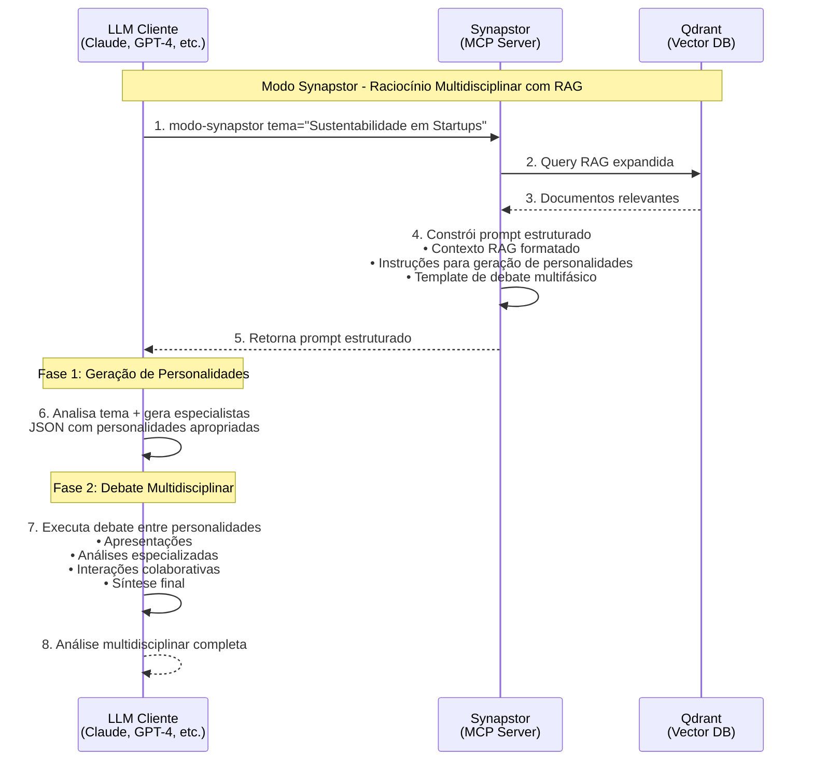

# Modo Synapstor - Sistema de Raciocínio Multidisciplinar com RAG

## 🧠 Visão Geral

O **Modo Synapstor** é uma ferramenta MCP avançada que constrói prompts estruturados para ativar raciocínio multidisciplinar em LLMs. O sistema combina recuperação automática de contexto (RAG) do banco Qdrant com instruções para o LLM gerar e orquestrar debates entre personalidades especializadas.

### 🎯 Objetivo

Fornecer ao LLM cliente um prompt estruturado que o instrui a:
1. **Gerar personalidades especializadas** dinamicamente baseadas no tema
2. **Utilizar contexto RAG** recuperado automaticamente do Qdrant
3. **Executar debate multidisciplinar** com perspectivas complementares
4. **Produzir análise rica** com sínteses e recomendações

**Importante**: O Synapstor **fornece o contexto e as instruções**; o **LLM executa o raciocínio**.

## 🏗️ Arquitetura MCP

### Componentes Atuais

```
modo_synapstor/
├── 📊 Estruturas de Dados
│   ├── ContextoRAG (dataclass) - resultados da consulta Qdrant
│   └── ConfiguracaoDebate (dataclass) - parâmetros de execução
├── 🔍 Consultor RAG
│   ├── Consulta ao Qdrant via connector existente
│   ├── Expansão inteligente de query
│   └── Formatação de documentos recuperados
├── 📝 Construtor de Prompt Dinâmico
│   ├── Template multifásico (geração + debate)
│   ├── Formatação de contexto RAG
│   └── Instruções estruturadas para o LLM
└── 🛠️ Ferramentas MCP
    ├── modo-synapstor (ferramenta principal)
    ├── info-modo-synapstor (informações sobre funcionamento)
    └── configurar-synapstor (configuração opcional)
```

**Nota**: Personalidades customizadas são fornecidas como JSON diretamente, sem necessidade de dataclass.

### 🔄 Fluxo Arquitetural



## 🧠 Abordagem Dinâmica - LLM Gera Especialistas

### Como o Sistema Funciona

O Modo Synapstor utiliza **instruções estruturadas** que orientam o LLM cliente a gerar personalidades especializadas dinamicamente, eliminando templates pré-definidos.

#### 🎯 Processo de Duas Fases:
1. **Synapstor prepara**: Recupera contexto RAG relevante do Qdrant
2. **Synapstor instrui**: Constrói prompt com instruções detalhadas para geração
3. **LLM executa Fase 1**: Analisa tema e gera especialistas apropriados (JSON)
4. **LLM executa Fase 2**: Orquestra debate multidisciplinar com contexto RAG

#### ✨ Vantagens da Arquitetura MCP:
- **Adaptação Total**: LLM cria especialistas perfeitos para qualquer tema
- **Contexto Factual**: Synapstor fornece documentos relevantes via RAG
- **Zero Templates**: Não requer manutenção de listas pré-definidas
- **Inteligência Emergente**: LLM seleciona as perspectivas mais relevantes
- **Flexibilidade Infinita**: Funciona para temas nicho, emergentes ou interdisciplinares

#### 💡 Exemplos de Especialistas que o LLM Geraria:

| Tema | Especialistas Típicos Gerados pelo LLM |
|------|----------------------------------------|
| "Ética em NFTs para Arte Digital" | Advogado IP, Artista digital, Expert blockchain, Filósofo da arte |
| "Acessibilidade em Jogos VR" | Designer UX acessível, Dev VR, Terapeuta ocupacional, Especialista WCAG |
| "Sustentabilidade em Data Centers" | Arquiteto infraestrutura, Expert energia renovável, Analista ESG, Engenheiro eficiência |

## 🚀 Como Usar

### 1. Via Interface MCP

```python
# Uso básico
prompt = await modo_synapstor(
    ctx=context,
    tema="Inteligência Artificial na Educação"
)

# Uso avançado
prompt = await modo_synapstor(
    ctx=context,
    tema="Arquitetura de Microserviços",
    max_personalidades=5,
    limite_documentos=8,
    namespace="meus_projetos",
    incluir_contexto_debug=True
)
```

### 2. Via Cliente MCP

```bash
# Comando básico
modo-synapstor tema="Blockchain e Sustentabilidade"

# Com parâmetros customizados
modo-synapstor tema="Design Thinking" max_personalidades=4 limite_documentos=5
```

### 3. Ferramentas Auxiliares

```bash
# Informações sobre funcionamento dinâmico
info-modo-synapstor

# Configurar personalidades customizadas
configurar-synapstor tema="DevOps" personalidades_customizadas='[{"nome": "..."}]'
```

## 📄 Exemplo de Prompt Gerado (Nova Abordagem)

```
Modo Synapstor ativado - Raciocínio Multidisciplinar com RAG.

🧠 Tema: Sustentabilidade em Startups de Tecnologia

📚 Contexto recuperado via Qdrant:
📊 Total de documentos relevantes encontrados: 3

📄 Documento 1 (Fonte: green_tech/carbon_footprint.md):
Startups podem reduzir pegada de carbono em 40% com práticas de green computing...

📄 Documento 2 (Fonte: investment/esg_criteria.md):
Critérios ESG tornaram-se fundamentais para captação de investimento...

🎭 PRIMEIRA FASE - Geração de Personalidades:

Você é um especialista em criar personalidades para debates multidisciplinares.

TEMA: Sustentabilidade em Startups de Tecnologia

INSTRUÇÕES:
Crie exatamente 4 personalidades especializadas que seriam as mais adequadas para debater sobre "Sustentabilidade em Startups de Tecnologia"...

[Prompt completo para geração dinâmica de personalidades]

🎯 SEGUNDA FASE - Instruções para o Debate:

Após gerar as personalidades na PRIMEIRA FASE, proceda com o debate multidisciplinar:

1. **Apresentação das Personalidades**: Cada personalidade se apresenta brevemente
2. **Análise Multidisciplinar**: Use o contexto RAG como base factual
3. **Debate Colaborativo**: Personalidades interagem e constroem ideias
4. **Síntese Multidisciplinar**: Consensos, tensões e recomendações

🚀 EXECUTE AS DUAS FASES SEQUENCIALMENTE...
```

## ⚙️ Configuração Avançada

### Personalidades Customizadas

```json
[
  {
    "nome": "Arquiteto de Software Sênior",
    "expertise": "Arquitetura de Sistemas Distribuídos",
    "papel": "Projetista de Soluções Escaláveis",
    "estilo": "técnico-pragmático",
    "perspectiva": "performance e maintibilidade"
  },
  {
    "nome": "UX Designer Principal",
    "expertise": "Experiência do Usuário e Design Thinking",
    "papel": "Defensor da Usabilidade",
    "estilo": "empático-visual",
    "perspectiva": "centrada no usuário"
  }
]
```

### Configurações de Debate

```python
configuracao = ConfiguracaoDebate(
    max_personalidades=5,      # Máximo de especialistas
    min_personalidades=3,      # Mínimo para debate
    limite_documentos_rag=5,   # Documentos RAG a recuperar
    namespace_padrao="projetos", # Coleção Qdrant
    relevancia_minima=0.3      # Score mínimo de relevância
)
```

## 🔧 Implementação Técnica Atual

### Consulta RAG ao Qdrant

```python
async def consultar_contexto(tema: str, configuracao: ConfiguracaoDebate) -> ContextoRAG:
    """Consulta Qdrant com query expandida para recuperar contexto relevante"""
    query_expandida = self._expandir_query(tema)
    resultados = await self.qdrant_connector.search(
        query=query_expandida,
        limit=configuracao.limite_documentos_rag,
        collection_name=configuracao.namespace_padrao
    )

    return ContextoRAG(
        documentos=resultados_processados,
        query_original=tema,
        total_encontrados=len(resultados)
    )
```

### Geração de Prompt Dinâmico

```python
def gerar_prompt_personalidades(tema: str, num_personalidades: int) -> str:
    """Gera instruções para o LLM criar personalidades específicas"""
    return PROMPT_GERADOR_PERSONALIDADES.format(
        tema=tema,
        num_personalidades=num_personalidades
    )
```

### Construção de Prompt Multifásico

```python
def construir_prompt_dinamico(tema: str, num_personalidades: int, contexto_rag: ContextoRAG) -> str:
    """Constrói prompt estruturado com duas fases de execução"""
    return TEMPLATE_PROMPT_DINAMICO.format(
        tema=tema,
        contexto_qdrant=self._formatar_contexto_qdrant(contexto_rag),
        prompt_personalidades=GeradorPersonalidades.gerar_prompt_personalidades(tema, num_personalidades),
        num_personalidades=num_personalidades
    )
```

## 🧪 Exemplo de Integração

```python
# exemplo_uso.py
import asyncio
from synapstor.plugins.tool_modo_synapstor import (
    GeradorPersonalidades,
    ConsultorRAG,
    ConstrutorPrompt
)

async def exemplo_completo():
    # 1. Detectar domínio
    tema = "Machine Learning na Medicina"
    dominio = GeradorPersonalidades.detectar_dominio(tema)

    # 2. Gerar personalidades
    personalidades = GeradorPersonalidades.gerar_personalidades(tema, config)

    # 3. Consultar RAG
    consultor = ConsultorRAG(qdrant_connector)
    contexto = await consultor.consultar_contexto(tema, config)

    # 4. Construir prompt
    prompt = ConstrutorPrompt.construir_prompt(
        tema, personalidades, contexto, dominio
    )

    print(prompt)

asyncio.run(exemplo_completo())
```

## 📊 Métricas e Performance

### Tempos Típicos de Resposta
- **Detecção de domínio**: ~1ms
- **Geração de personalidades**: ~5ms
- **Consulta RAG**: ~100-500ms (dependente do Qdrant)
- **Construção de prompt**: ~10ms
- **Total**: ~120-520ms

### Uso de Recursos
- **Memória**: ~2-5MB por sessão
- **CPU**: Baixo (principalmente I/O com Qdrant)
- **Rede**: Dependente da latência do Qdrant

## 🔒 Considerações de Segurança

### Validação de Input
- Sanitização de temas e parâmetros
- Validação de JSON para personalidades customizadas
- Limite de caracteres para prevenir DoS

### Privacidade de Dados
- Nenhum dado pessoal é armazenado permanentemente
- Consultas RAG respeitam permissões de coleção
- Logs de debug podem ser desabilitados

## 🐛 Troubleshooting

### Problemas Comuns

#### 1. Erro: "Não foi possível acessar o servidor MCP"
```bash
# Solução: Verificar se o plugin foi carregado corretamente
grep "modo_synapstor" logs/synapstor.log
```

#### 2. Contexto RAG vazio
```bash
# Verificar se a coleção existe no Qdrant
curl http://localhost:6333/collections
```

#### 3. Personalidades não geradas
```python
# Debug: verificar detecção de domínio
dominio = GeradorPersonalidades.detectar_dominio("seu tema")
print(f"Domínio detectado: {dominio}")
```

### Logs de Debug

```python
# Ativar logs detalhados
import logging
logging.getLogger("synapstor.plugins.tool_modo_synapstor").setLevel(logging.DEBUG)
```

## 🚧 Roadmap

### Versão Atual (v2.0 - Dinâmica)
- ✅ Geração dinâmica de personalidades via LLM
- ✅ Consulta RAG integrada ao Qdrant
- ✅ Prompt multifásico estruturado
- ✅ Personalidades customizadas opcionais
- ✅ Zero dependência de templates fixos

### Próximas Versões
- 🔄 Cache inteligente de consultas RAG
- 🔄 Integração com múltiplas fontes de dados
- 🔄 Métricas de qualidade dos prompts gerados
- 🔄 Suporte a debates assíncronos (múltiplas rodadas)
- 🔄 Templates de prompt configuráveis por usuário

## 🤝 Contribuindo

### Melhorando o Prompt Dinâmico

1. Editar `PROMPT_GERADOR_PERSONALIDADES` em `tool_modo_synapstor.py`
2. Testar instruções com diferentes tipos de temas
3. Validar qualidade das personalidades geradas
4. Atualizar documentação

### Personalidades Customizadas (Opcional)

Para casos muito específicos onde você quer forçar determinados especialistas, você pode fornecer um JSON:

```bash
# Via ferramenta MCP
configurar-synapstor tema="DevOps" personalidades_customizadas='[
  {
    "nome": "Site Reliability Engineer",
    "expertise": "Observabilidade e Monitoramento",
    "papel": "Especialista em Confiabilidade",
    "estilo": "pragmático-técnico",
    "perspectiva": "prevenção de incidentes"
  },
  {
    "nome": "Platform Engineer",
    "expertise": "Infraestrutura como Código",
    "papel": "Arquiteto de Plataforma",
    "estilo": "sistemático-escalável",
    "perspectiva": "developer experience"
  }
]'
```

**Importante**: Na maioria dos casos, deixe o LLM gerar as personalidades dinamicamente para obter melhor adequação ao tema.

## 📚 Referências

- [Model Context Protocol (MCP)](https://modelcontextprotocol.io/)
- [Qdrant Vector Database](https://qdrant.tech/)
- [FastEmbed](https://github.com/qdrant/fastembed)
- [Retrieval-Augmented Generation](https://arxiv.org/abs/2005.11401)

---

**Modo Synapstor** - Elevando o raciocínio multidisciplinar com IA 🧠✨
